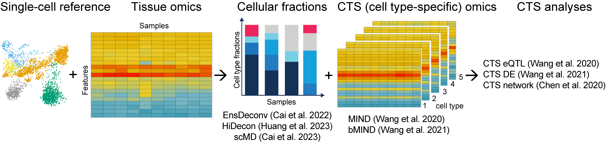




  


# Major publications

## Cellular deconvolution and cell type-specific analyses

[HiDecon](https://github.com/randel/HiDecon): <ins>Huang, Penghui</ins>, <ins>Cai, Manqi</ins>, Xinghua Lu, Chris McKennan, and **Wang, Jiebiao**+.
Accurate estimation of rare cell type fractions from tissue omics data via hierarchical
deconvolution. [bioRxiv](https://www.biorxiv.org/content/10.1101/2023.03.15.532820v1), 2023. 

[EnsDeconv](https://github.com/randel/EnsDeconv): <ins>Cai, Manqi</ins>, Molin Yue, Tianmeng Chen, Jinling Liu, Erick Forno, Xinghua Lu, Timothy
Billiar, Juan Celedón, Chris McKennan, Wei Chen+, and **Wang, Jiebiao**+. Robust and
accurate estimation of cellular fraction from tissue omics data via ensemble deconvolution. [Bioinformatics](https://academic.oup.com/bioinformatics/article/38/11/3004/6570586?login=false), volume 38, pages 3004–3010, 2022.

[bMIND](https://github.com/randel/MIND): **Wang, Jiebiao**+, Kathryn Roeder+, and Bernie Devlin+. Bayesian estimation of
cell type–specific gene expression with prior derived from single-cell data. [Genome
research](https://genome.cshlp.org/content/31/10/1807.long), volume 31, pages 1807–1818, 2021.

[MIND](https://github.com/randel/MIND/blob/master/MIND.md): **Wang, Jiebiao**, Bernie Devlin, and Kathryn Roeder. Using multiple measurements
of tissue to estimate subject-and cell-type-specific gene expression. [Bioinformatics](https://academic.oup.com/bioinformatics/article/36/3/782/5545976),
volume 36, pages 782–788, 2020. (_Platform talk, ASHG 2018_)

Siwei Chen\*, **Wang, Jiebiao**\*, Ercument Cicek, Kathryn Roeder, Haiyuan Yu, and
Bernie Devlin. De novo missense variants disrupting protein–protein interactions affect
risk for autism through gene co-expression and protein networks in neuronal cell types.
_Molecular autism_, volume 11, pages 1–16, 2020.

## Statistical genomics

Kyle Satterstrom\*, Jack Kosmicki\*, **Wang, Jiebiao***, Michael S Breen, Silvia De Rubeis,
Joon-Yong An, Minshi Peng, Ryan Collins, Jakob Grove, Lambertus Klei, et al. Large-scale exome sequencing study implicates both developmental and functional changes
in the neurobiology of autism. [Cell](https://www.sciencedirect.com/science/article/pii/S0092867419313984), volume 180, pages 568–584, 2020.

[mvMISE](https://github.com/randel/mvMISE): **Wang, Jiebiao**, Pei Wang, Donald Hedeker, and Lin S Chen. Using multivariate
mixed-effects selection models for analyzing batch-processed proteomics data with
non-ignorable missingness. [Biostatistics](https://academic.oup.com/biostatistics/article/20/4/648/5043454), volume 20, pages 648–665, 2019.

[ofGEM](https://github.com/randel/ofGEM): **Wang, Jiebiao***, Qianying Liu*, Brandon Pierce, Dezheng Huo, Olufunmilayo Olopade,
Habibul Ahsan, and Lin Chen. A meta-analysis approach with filtering for identifying
gene-level gene-environment interactions. [Genetic epidemiology](https://onlinelibrary.wiley.com/doi/abs/10.1002/gepi.22115), volume 42, pages
434–446, 2018.

[MixRF](https://github.com/randel/MixRF): **Wang, Jiebiao**, Eric R Gamazon, Brandon L Pierce, Barbara E Stranger, Hae Kyung
Im, Robert D Gibbons, Nancy J Cox, Dan L Nicolae, and Lin S Chen. Imputing gene
expression in uncollected tissues within and beyond GTEx. [The American Journal of
Human Genetics](https://www.cell.com/ajhg/fulltext/S0002-9297(16)00071-9), volume 98, pages 697–708, 2016.

\* Joint first author;
\+ Corresponding author; <ins>student</ins>
